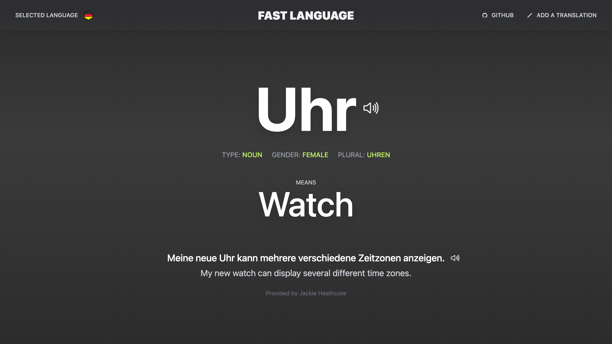

<!-- title -->

  
  <h1>Fast Language Extension</h1>
  
A Chrome extension to learn languages faster whenever you open a new tab.

  
  
Whenever you open a new tab, you will get an opportunity to learn a new word with a simple example. 

  <!-- supported languages -->
  <h4>Supported Languages</h4>
  

    
  

---

## How to contribute?

### ✍️ &nbsp; Add a translation

At the moment, we only support German language translations. You can help us by adding a word translation in the [fast-language-translations](https://github.com/thatisuday/fast-language-translations) repository. There, you will find instructions on how to create a new translation.

### 🏞 &nbsp; Modify extension UI

If you want to make extension user interface more user friendly, you can update React source code in this repository. We are using [create-react-app.dev](https://create-react-app.dev/) to build the user interface so you need to follow their standard guidelines. If you want to understand Chrome Extension development process, then follow [this](https://developer.chrome.com/docs/extensions/mv3/getstarted/) documentation.

### 🔐 &nbsp; Modify server API

This extension uses an API provided by [fast-language-server](https://github.com/thatisuday/fast-language-server) repository. There, you will find documentation and instructions on how to update the API code.
